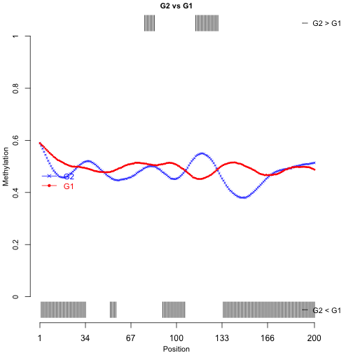
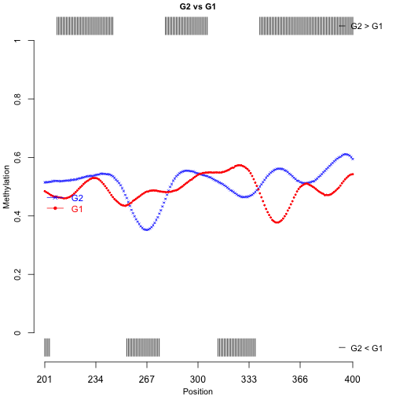

The `DMCFB` package is a pipeline to identify differentially methyalted 
cytosines (DMC) in bisulfite sequencing data using Bayesian functional
regression models. 
In what follows we provides some guidlines on how to read your data and analyze
them.

## Reading data
### Reading bisulfite data (using files)
The R-method `readBismark()` is used to read bisulfite data files that are 
created by `Bismark`. Each file must include six columns, with no header, that 
represent 

 - Chromosome 
 - Start position in the chromosome  
 - End position in the chromosome
 - Methylation level (m/(m+u))
 - Number of methylated reads (m)
 - Number of un-methylated reads (u)

and each row is a cytonsine (or a small region) in DNA. 

The function  `readBismark(<files' paths>, <files' names>)` has two inputs: 
'the paths of the files' and 'the names of the files'.
Using this function an object of class `BSDMC` is created. 
Extra information about data such as Age, Gender, Group, etc, must be assigned
to the object using `DataFrame` function. 
As an example, we have provided three files in the package that can be read as 
follows:


```r
library(DMCFB)
fn <- list.files(system.file("extdata",package = "DMCFB"))
fn.f <- list.files(system.file("extdata",package="DMCFB"), full.names=TRUE)
OBJ <- readBismark(fn.f, fn)
#> Processing sample blk.BCU1568_BC_BS_1 ... 
#> Processing sample blk.BCU173_TC_BS_1 ... 
#> Processing sample blk.BCU551_Mono_BS_1 ... 
#> Building BSDMC object.
cdOBJ <- DataFrame(Cell = factor(c("BC", "TC","Mono"),
levels = c("BC", "TC", "Mono")), row.names = c("BCU1568","BCU173","BCU551"))
colData(OBJ) <- cdOBJ
OBJ
#> class: BSDMC 
#> dim: 25668 3 
#> metadata(0):
#> assays(3): methReads totalReads methLevels
#> rownames(25668): 1 2 ... 25667 25668
#> rowData names(0):
#> colnames(3): BCU1568 BCU173 BCU551
#> colData names(1): Cell
```


### Reading bisulfite data (using matrices)
Alternatively, one can use two integer matrices and a `DataFrame` to create
`BSDMC` object using `cBSDMC()` function. One matrix includes the read-depth and
the other one includes methylation reads. The columns of these matrices 
represent samples and the rows represent cytosine positions. 

Additional information about the genomic positions and covariates must be stored
in a `DataFrame` and then assign to the object. 

The following exampel shows the details. 


```r
library(DMCFB)
set.seed(1980)
nr <- 1000; nc <- 8
metht <- matrix(as.integer(runif(nr * nc, 0, 100)), nr)
methc <- matrix(rbinom(n=nr*nc,c(metht),prob = runif(nr*nc)),nr,nc)
methl <- methc/metht
r1 <- GRanges(rep('chr1', nr), IRanges(1:nr, width=1), strand='*')
names(r1) <- 1:nr
cd1 <- DataFrame(Group=rep(c('G1','G2'),each=nc/2),row.names=LETTERS[1:nc])
OBJ2 <- cBSDMC(rowRanges=r1,methReads=methc,totalReads=metht,
methLevels=methl,colData=cd1)
OBJ2
#> class: BSDMC 
#> dim: 1000 8 
#> metadata(0):
#> assays(3): methReads totalReads methLevels
#> rownames(1000): 1 2 ... 999 1000
#> rowData names(0):
#> colnames(8): A B ... G H
#> colData names(1): Group
```

## Identifying DMCs
To identify DMCs, one need to use the function `findDMCFB()` function. 
The function


```r
library(DMCFB)
start.time <- Sys.time()
path0 <- "..//BCData/" # provide the path to the files
namelist.new <- list.files(path0,pattern="blk",full.names=F)
namelist.new.f <- list.files(path0,pattern="blk",full.names=T)
type <- NULL
for(i in seq_along(namelist.new)){
    type[i] <- unlist(strsplit(namelist.new[i], split=c('_'), fixed=TRUE))[2]
}
type
table(type)
indTC <- which(type=="TC")
indBC <- which(type=="BC")
indMono <- which(type=="Mono")
namelist.new <- namelist.new[c(indBC,indMono,indTC)]
namelist.new.f <- namelist.new.f[c(indBC,indMono,indTC)]
BLKDat <- readBismark(namelist.new.f, namelist.new)
colData1 <- DataFrame(Group = factor(
    c(rep("BC",length(indBC)), rep("Mono",length(indMono)), 
      rep("TC", length(indTC))), levels = c("BC", "Mono", "TC")), 
    row.names = colnames(BLKData))
colData(BLKDat) <- colData1
BLK.BC.Mono.TC <- sort(BLKDat)
DMC.obj = findDMCFB(object = BLKDat, bwa = 30, bwb = 30, nBurn = 300, nMC = 300,
                    nThin = 1, alpha = 5e-5, pSize = 500, sfiles = FALSE)
```


## Figures
To plot DMCs one can use the `plotDMCFB()` function to plot an `BSDMC` object 
that resulted from running `findDMCFB()` function. 
To illustrate use the following example:


```r
library(DMCFB)
set.seed(1980)
nr <- 1000; nc <- 8
metht <- matrix(as.integer(runif(nr * nc, 0, 100)), nr)
methc <- matrix(rbinom(n=nr*nc,c(metht),prob = runif(nr*nc)),nr,nc)
methl <- methc/metht
r1 <- GRanges(rep('chr1', nr), IRanges(1:nr, width=1), strand='*')
names(r1) <- 1:nr
cd1 <- DataFrame(Group=rep(c('G1','G2'),each=nc/2),row.names=LETTERS[1:nc])
OBJ1 <- cBSDMC(rowRanges=r1,methReads=methc,totalReads=metht,
methLevels=methl,colData=cd1)
OBJ2 = findDMCFB(object = OBJ1, bwa = 30, bwb = 30, nBurn = 10, nMC = 10,
                    nThin = 1, alpha = 0.05, pSize = 500, sfiles = FALSE)
#> ------------------------------------------------------------
#> Running Bayesian functional regression model ...
#> The priors's SD = 0.3027, estimated from data ... 
#> Number of assigned cores: 6 ... 
#> ------------------------------------------------------------
#> Fitted model: logit(MethRead/ReadDepth) ~ F(Group) 
#> ------------------------------------------------------------
#> Creating 1 batches of genomic positions ... 
#> Running batch 1/1; chr1; 1000 positions; Region [   1, 1000]; Date 2019-07-02 16:43:03
#> ------------------------------------------------------------
#> Combining 1 objects ... 
#> Objects are combined.
#> ------------------------------------------------------------
#> Identifying DMCs ...
#> DMCs are identified.
#> ------------------------------------------------------------
#> Percentage of non-DMCs and DMCs:
#> Equal(%)   DMC(%) 
#>     36.6     63.4 
#> ------------------------------------------------------------
#> Percentage of hyper-, hypo-, and equal-methylated positions:
#>        Equal(%) Hyper(%) Hypo(%)
#> G2vsG1     36.6     28.5    34.9
#> ------------------------------------------------------------
plotDMCFB(OBJ2, region = c(1,400), nSplit = 2)
```



